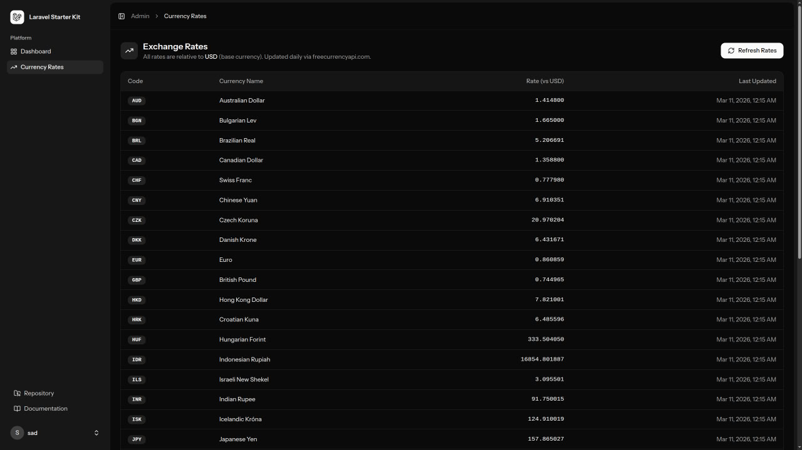
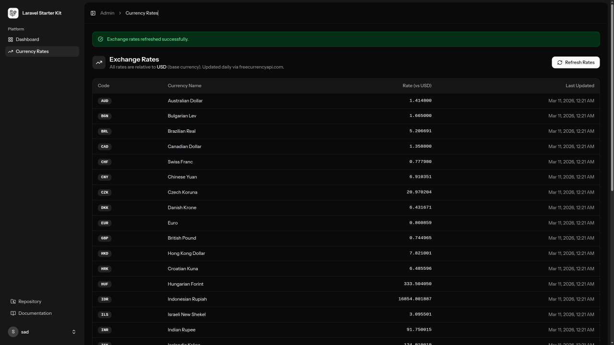

# Firebird Currency

A Laravel application with a **Currency Conversion Module** — fetches live exchange rates from [freecurrencyapi.com](https://freecurrencyapi.com), stores them in the database, and exposes a service for currency conversion and an admin panel for rate management.

---

## Stack

| Layer | Technology |
|---|---|
| Backend | PHP 8.4 · Laravel 12 |
| Frontend | React 19 · TypeScript · Inertia.js v2 |
| Styling | Tailwind CSS v4 |
| Auth | Laravel Fortify |
| Routing (typed) | Laravel Wayfinder |
| Database | MySQL (via Sail) |
| Testing | PHPUnit 11 |
| Dev environment | Laravel Sail (Docker) |

---
## Preview




---
## Requirements

- Docker + Docker Compose
- Make

---

## Setup

**1. Clone and install dependencies**

```bash
git clone <repo-url> firebird-currency
cd firebird-currency
composer install
cp .env.example .env
```

**2. Add your API key to `.env`**

Get a free key at [freecurrencyapi.com](https://freecurrencyapi.com/dashboard):

```dotenv
FREECURRENCYAPI_KEY=your_api_key_here
```

**3. Start Sail and run migrations**

```bash
make up
make migrate
make artisan c="db:seed"
```

**4. Build frontend assets**

```bash
make npm-build
```

The app is now available at `http://localhost`.

---

## Makefile Commands

```bash
make up            # Start Docker containers
make down          # Stop and remove containers
make restart       # Restart containers
make migrate       # Run migrations
make fresh         # Fresh migrate + seed
make fetch-rates   # Fetch latest exchange rates from the API
make test          # Run full test suite
make pint          # Format PHP code
make npm-dev       # Start Vite dev server
make npm-build     # Build frontend assets
make shell         # Open shell inside the app container
make artisan c=''  # Run any Artisan command
```

---

## Currency Module Workflow

```
freecurrencyapi.com
        │
        │ HTTP (Laravel Http / Guzzle)
        ▼
app:fetch-currency-rates     ← runs daily via scheduler
        │                       or manually: make fetch-rates
        ▼
currency_rates table         ← decimal(16,8) precision per rate
        │
        ▼
CurrencyConverterService     ← BCMath arithmetic, 1h cache
        │
        ▼
Admin panel /admin/currencies
```

**Conversion example:**

```php
$converter = app(\App\Services\CurrencyConverterService::class);

$converter->convert(123, 'USD', 'RUB');  // → float
$converter->convert(100, 'EUR', 'JPY');  // → float
```

**Manual rate refresh (CLI):**

```bash
make fetch-rates
```

**Scheduler** (runs automatically once a day — enable cron in production):

```
* * * * * cd /path-to-project && php artisan schedule:run >> /dev/null 2>&1
```

---

## Cursor IDE Setup

This project uses **Laravel Boost MCP** for AI-assisted development inside Cursor.

**1. Start Sail first** (MCP connects to the running container):

```bash
make up
```

**2. Open the project in Cursor** — the MCP server is pre-configured in `boost.json`. Cursor will auto-connect to the Boost MCP tools (Tinker, database queries, browser logs, docs search, Artisan).

**3. Recommended Cursor settings** — the project includes workspace rules in `.cursor/` that enforce Laravel conventions, Pint formatting, and PHPUnit testing patterns. These are picked up automatically.

---

## Testing

```bash
make test                          # full suite

# Currency module only:
vendor/bin/sail artisan test --compact \
  tests/Feature/Admin/CurrencyControllerTest.php \
  tests/Feature/Commands/FetchCurrencyRatesCommandTest.php \
  tests/Unit/Services/CurrencyConverterServiceTest.php
```

---

## Key Files

```
app/Console/Commands/FetchCurrencyRatesCommand.php   ← daily rate fetcher
app/Http/Controllers/Admin/CurrencyController.php    ← admin panel
app/Services/CurrencyConverterService.php            ← conversion logic
database/seeders/CurrencySeeder.php                  ← 33 currencies
resources/js/pages/admin/currency/index.tsx          ← rates table UI
routes/web.php                                       ← /admin/currencies
routes/console.php                                   ← scheduler
documentation/currency-module.md                     ← full module docs
```

